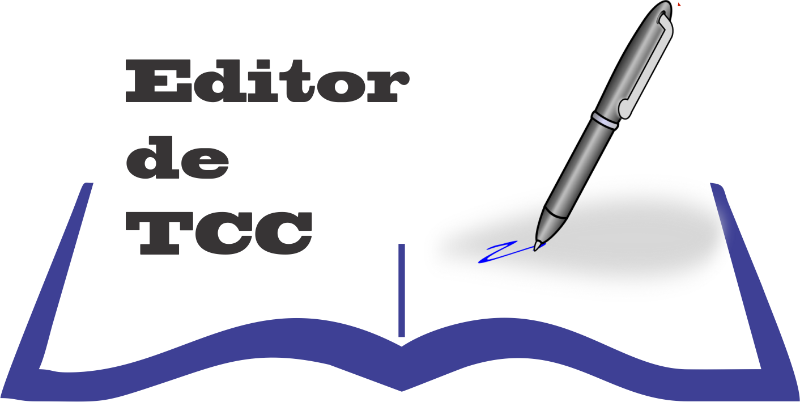

# Editor de TCC - TCC sem complicação

Ferramenta pedagógica para auxiliar os professores e alunos no desenvolvimento e na montagem do TCC.
O programa desenvolvido dá suporte a todas etapas de elaboração dos trabalhos de TCC.

Tecnologias envolvidas: SQL Server, ADO Net, Visual Studio 2015

