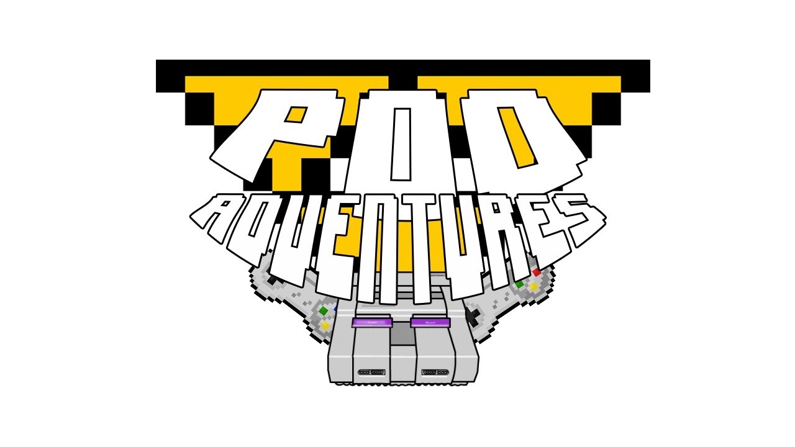

# POO Adventures - Aprendendo Programação Orientação a Objeto

Um jogo educacional de plataforma, em dimensão 2D, para explicar a relação de Stack e Heap, conceitos de Programação Orientada a Objetos.

Tecnologias: Construct 2

